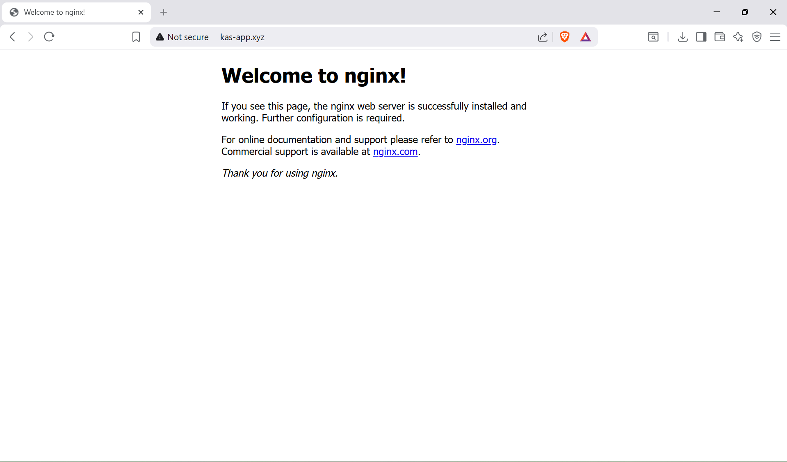

# NGINX Domain Project

## What I built
I deployed an NGINX web server on an EC2 instance and pointed it to my own custom domain (kas-app.xyz)

## What I learnt
- How to launch and configure an EC2 instance
- How to install and run NGINX on Ubuntu
- How A records work
- How to connect a domain to a server using Cloudflare
- How security groups control traffic on port 80

## Commands Used
# Update Packages
sudo apt update
# Install NGINX
sudo apt install -y nginx

# Enable NGINX on startup
sudo systemctl enable nginx

# Start NGINX
sudo systemctl start nginx

## Challenges
- Had SSL errors when first visiting the domain (fixed by setting 
  Cloudflare SSL to Off and switching to DNS only mode)
- DNS propagation took time before domain resolved correctly

## Screenshots

