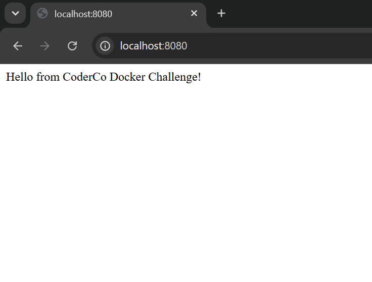
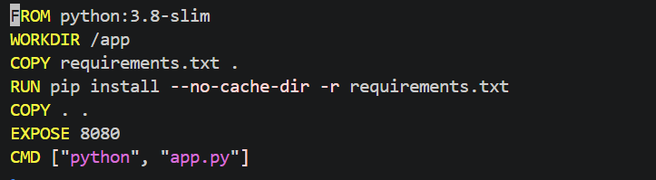
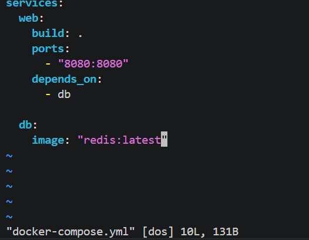

# Docker Challenge 1 — Containerising a Flask Application

## What I Built
A containerised Python Flask application built from scratch with a Redis
service managed via Docker Compose and pushed to Docker Hub.

## Files
- `app.py` — Flask application with two routes
- `Dockerfile` — builds the Flask app image
- `docker-compose.yml` — defines and runs both services
- `requirements.txt` — Python dependencies

## Routes
- `/` — displays a welcome message
- `/health` — returns OK, used to check the app is running

## Commands Used
```bash
# Build the image
docker build -t kasim/app .

# Run the container
docker run -p 8080:8080 kasim/app

# Tag for Docker Hub
docker tag kasim/app kas63/app:latest

# Push to Docker Hub
docker push kas63/app:latest

# Run with Docker Compose
docker compose up -d

# Check running containers
docker ps

# Stop containers
docker compose down
```

## What I Learnt
- How to write a Dockerfile from scratch
- How Docker layer caching works and why copy requirements.txt first
- The difference between an image and a container
- How to push an image to Docker Hub
- How to use Docker Compose to manage multiple services
- How YAML indentation defines ownership of properties

## Screenshots


