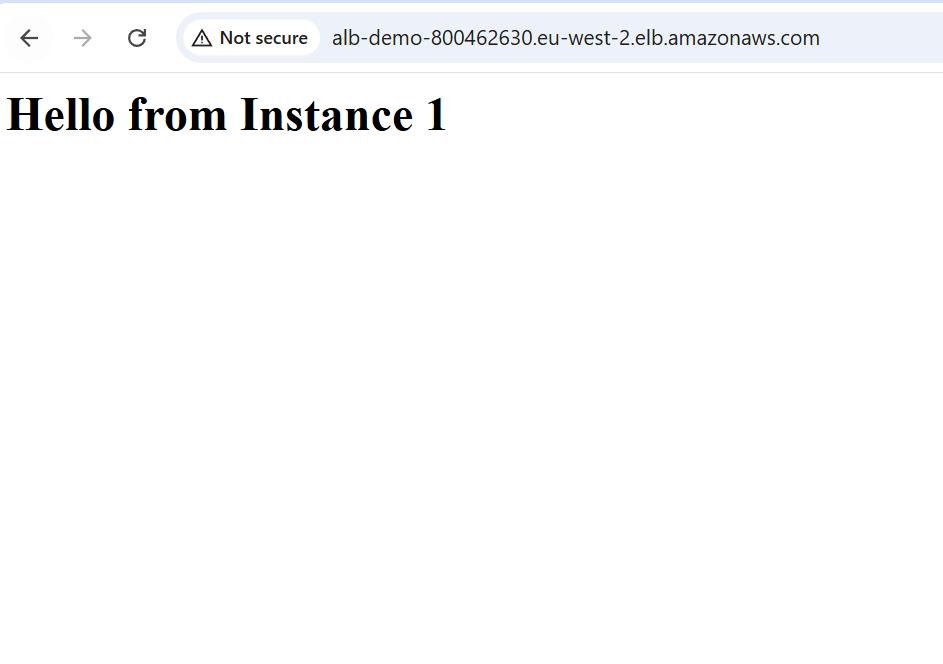
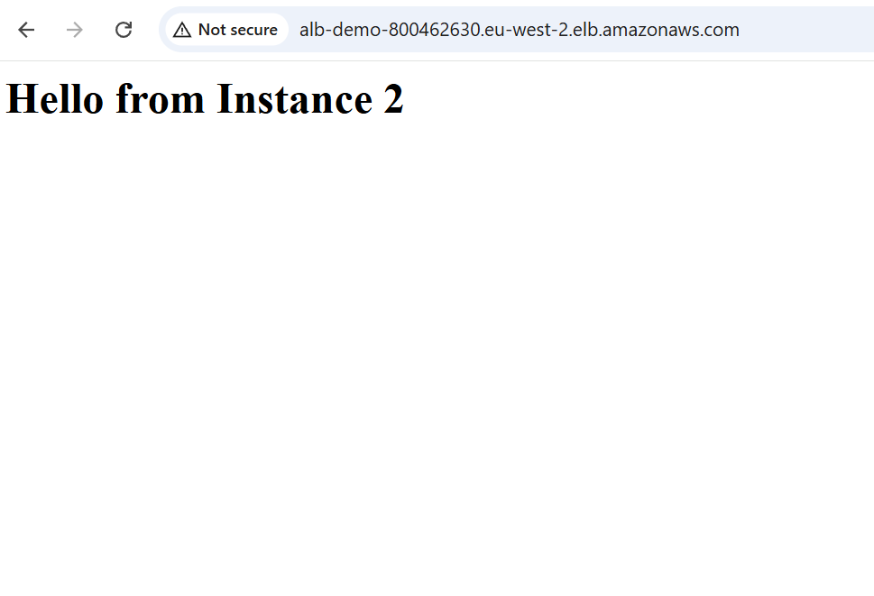
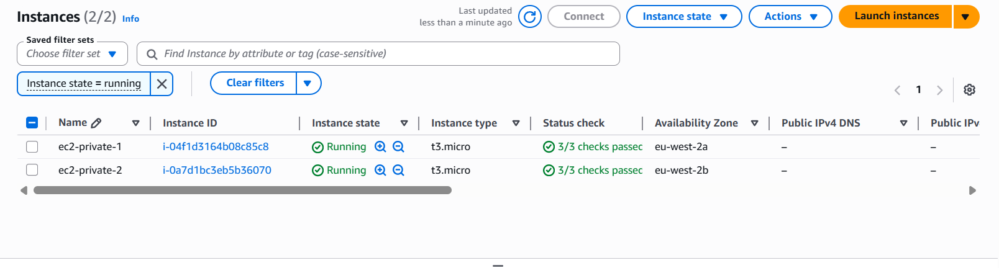
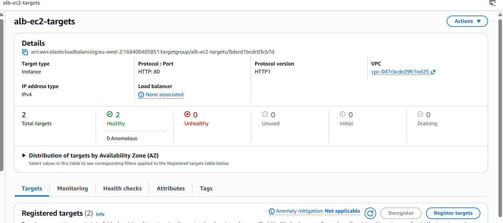

# AWS Assignment 2 — Application Load Balancer

## What I Built
Deployed two EC2 instances in private subnets behind an Application 
Load Balancer in public subnets. The ALB handles all incoming traffic 
and distributes it across both instances. EC2 instances are not 
directly accessible from the internet.

## Architecture
- VPC: 10.0.0.0/16
- Public Subnet 1: 10.0.0.0/24 → eu-west-2a (ALB)
- Public Subnet 2: 10.0.1.0/24 → eu-west-2b (ALB)
- Private Subnet 1: 10.0.2.0/24 → eu-west-2a (EC2 1)
- Private Subnet 2: 10.0.3.0/24 → eu-west-2b (EC2 2)
- Internet Gateway: attached to VPC
- NAT Gateway: in public-1 with Elastic IP
- ALB: internet facing, across both public subnets
- Target Group: both EC2 instances registered and healthy

## What I Learnt
- How an Application Load Balancer distributes traffic across EC2s
- How target groups and health checks work
- How to isolate EC2 instances in private subnets behind an ALB
- How security groups enforce traffic flow between ALB and EC2s
- How user data automates web server setup on EC2 launch
- Why EC2s should never be directly publicly accessible

## User Data Script
```bash
#!/bin/bash
yum update -y
yum install -y nginx
systemctl start nginx
systemctl enable nginx
echo "<h1>Hello from Instance 1</h1>" > /usr/share/nginx/html/index.html
```

## Security Groups
- ALB SG: allow HTTP port 80 from 0.0.0.0/0
- EC2 SG: allow HTTP port 80 from ALB SG only

## Challenges
- Initially launched EC2 instances in public subnets instead of 
  private subnets. Fixed by terminating and relaunching in correct 
  private subnets to ensure instances were not directly accessible to the internet.

## Screenshots




