# AWS Assignment 1 — VPC & Networking

## What I Built
A custom VPC from scratch with public and private subnets, internet 
access via an Internet Gateway, a NAT Gateway for private subnet 
outbound traffic, and EC2 instances deployed across both subnets.

## Architecture
- VPC: 10.0.0.0/16
- Public Subnet: 10.0.0.0/24
- Private Subnet: 10.0.1.0/24
- Internet Gateway: attached to VPC
- NAT Gateway: deployed in public subnet with Elastic IP
- Bastion Host (Public EC2): in public subnet
- Private EC2: in private subnet, no public IP

## What I Learnt
- How to design and build a custom VPC from scratch
- How CIDR ranges work and how to carve subnets without overlap
- The difference between public and private subnets
- How route tables control traffic flow
- How a NAT Gateway allows private resources to reach the internet
- How security groups control inbound and outbound access
- How a Bastion Host is used to securely access private EC2s

## Commands Used
```bash
# SSH into Bastion Host
ssh -i ~/kascoderco.pem ec2-user@<bastion-public-ip>

# SSH from Bastion into Private EC2
ssh -i ~/kascoderco.pem ec2-user@<private-ec2-ip>
```

## Challenges
- I was struggling to access the private subent initially. I double checked and had configured everything correctly. During the assignment, my internet was reset. When troubleshooting, I realised that my assigned IP had changed and only my previous IP address was included in the security group for SSH access. After changing this I was able to access the private subnet.

## Screenshots
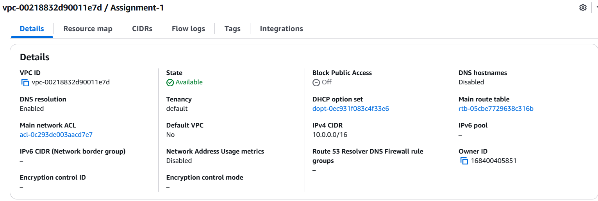
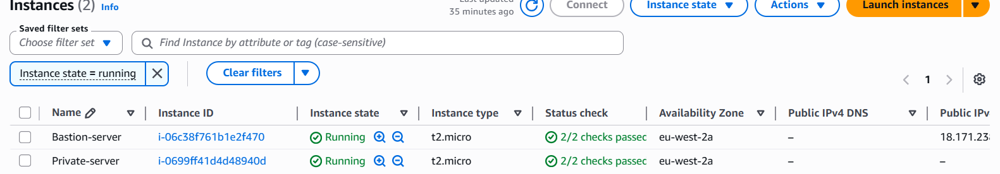
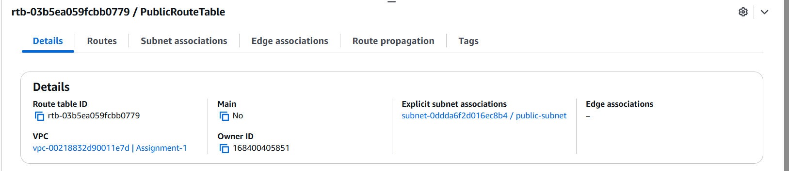
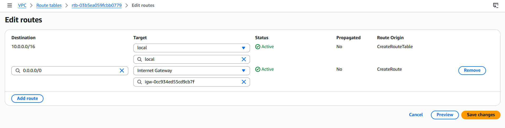
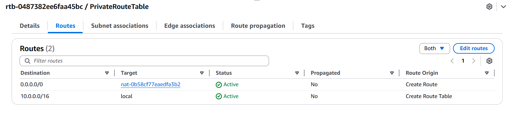
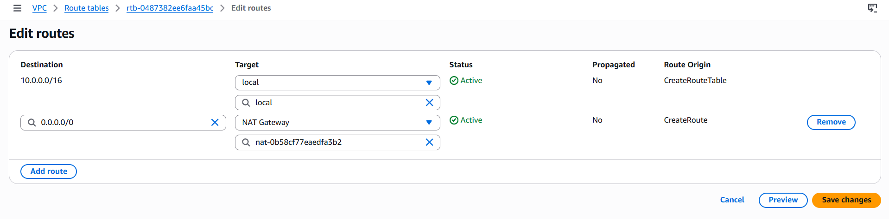
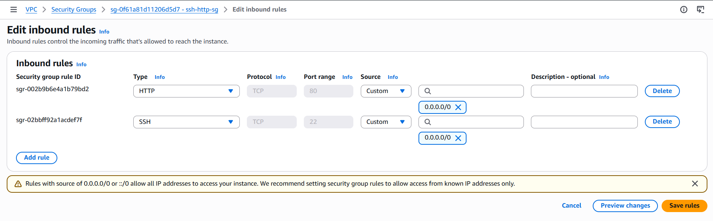
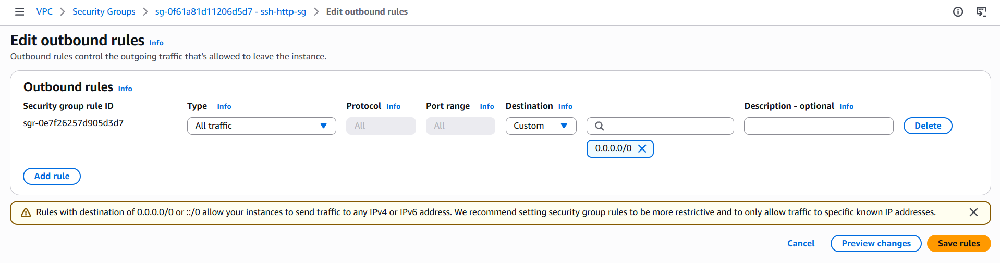
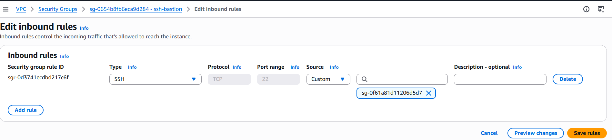
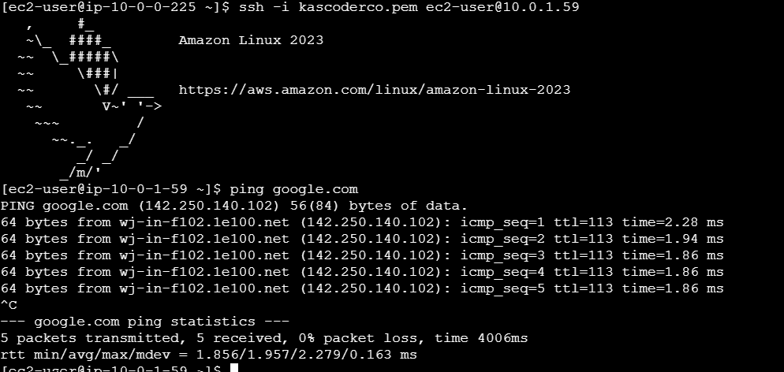
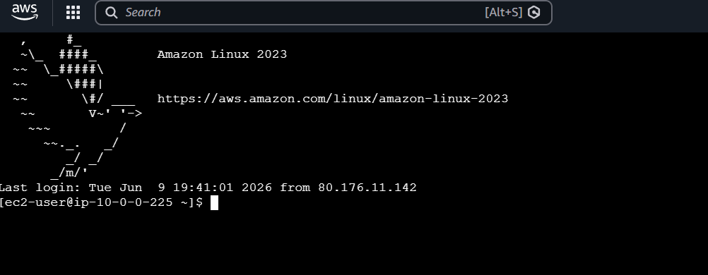
