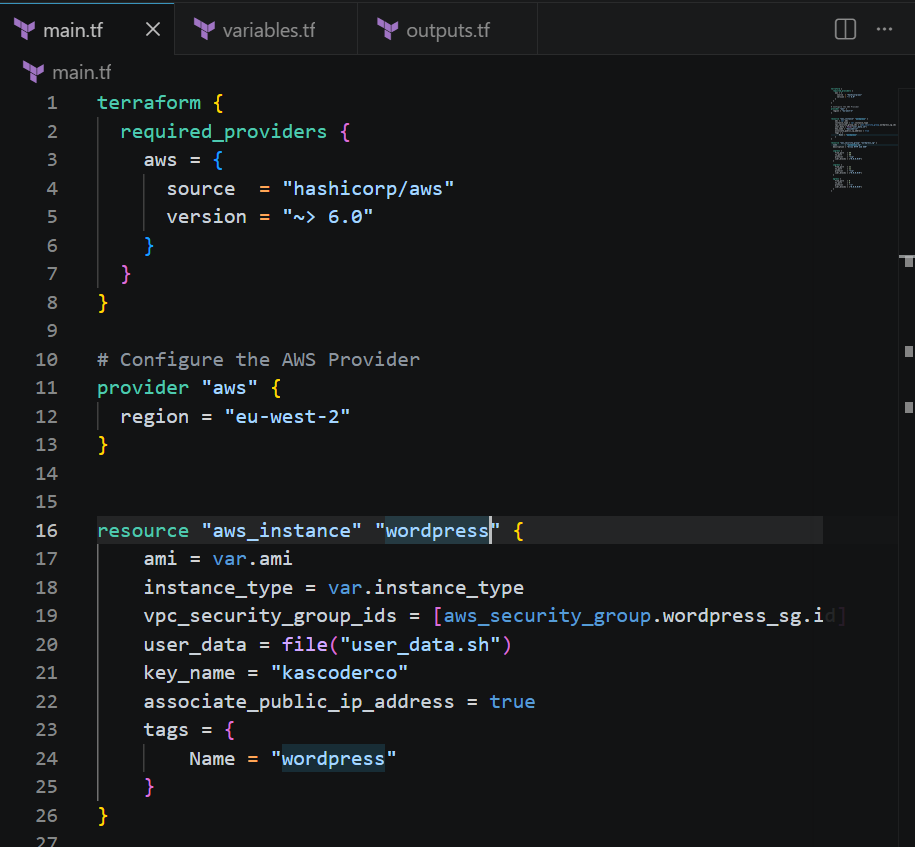
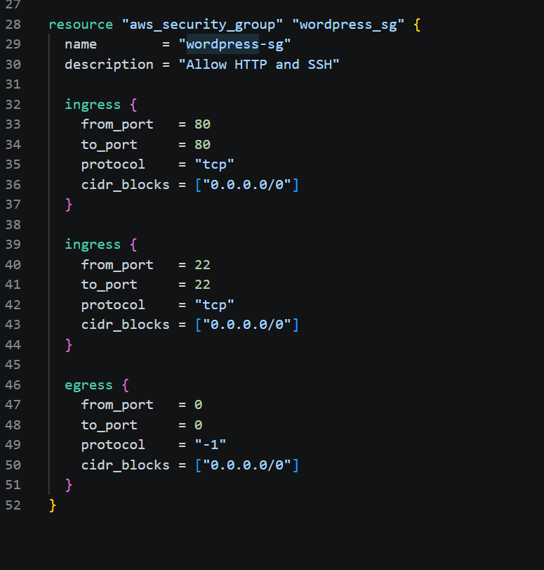
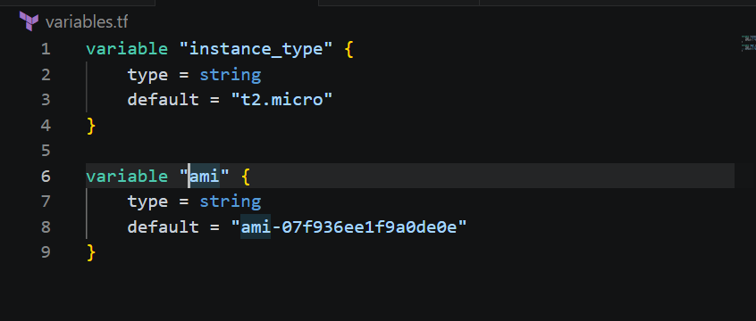
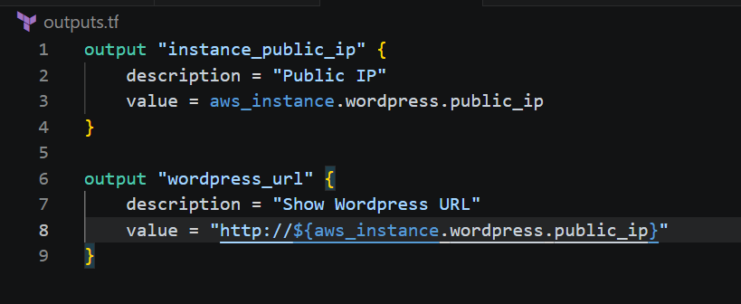
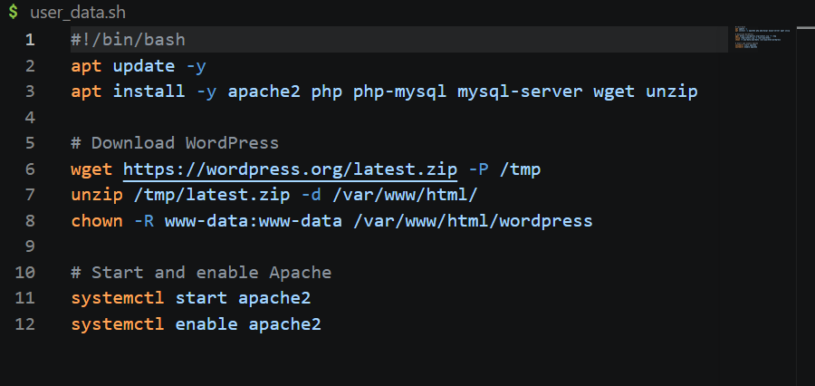

# Assignment 1 – Deploy WordPress Using Terraform

## Overview

This project provisions a fully working WordPress stack on AWS using Terraform. All infrastructure is defined as code — no manual clicking in the AWS console. The EC2 instance is automatically configured with Apache, PHP, MySQL and WordPress via a user data script that runs on first boot.

## What This Project Covers

- Writing a complete Terraform configuration from scratch
- Provisioning an EC2 instance using `main.tf`
- Defining input variables in `variables.tf`
- Exposing outputs (public IP and WordPress URL) in `outputs.tf`
- Writing a user data bash script to auto-install WordPress on boot
- Creating and attaching a security group via Terraform
- Verifying a live WordPress installation via browser

---

## File Structure

wordpress-deployment-terraform/
├── main.tf           # Provider, EC2 instance and security group resources
├── variables.tf      # Input variables (AMI, instance type)
├── outputs.tf        # Output values (public IP, WordPress URL)
├── user_data.sh      # Bash script to install WordPress on EC2 boot
└── screenshots/      # Evidence of working deployment

## Infrastructure Created

| Resource | Details |
|---|---|
| EC2 Instance | Ubuntu, t2.micro, eu-west-2 |
| Security Group | Inbound HTTP (80) and SSH (22), all outbound |
| Key Pair | kascoderco |
| WordPress | Installed via user data on first boot |

---

## How It Works

### 1. Provider Configuration (`main.tf`)
Terraform is configured to use the AWS provider targeting `eu-west-2` (London).

### 2. EC2 Instance
The instance uses the Ubuntu AMI and references the security group by ID. A user data script is passed in using the `file()` function, which runs automatically when the instance first boots.

### 3. Security Group
Two inbound rules are defined — port 80 for HTTP traffic so the WordPress site is publicly accessible, and port 22 for SSH access. All outbound traffic is allowed.

### 4. User Data Script (`user_data.sh`)
The script runs on EC2 first boot and:
- Updates system packages
- Installs Apache, PHP, PHP-MySQL, MySQL Server, wget and unzip
- Downloads the latest WordPress zip from wordpress.org
- Extracts it to the web root and sets correct file ownership for Apache
- Starts and enables Apache

### 5. Outputs
After `terraform apply`, the public IP and full WordPress URL are printed to the terminal automatically.

## How to Deploy

# Initialise Terraform and download providers
terraform init

# Preview what will be created
terraform plan

# Deploy the infrastructure
terraform apply

After apply completes, Terraform prints:

Outputs:

instance_public_ip = "x.x.x.x"
wordpress_url      = "http://x.x.x.x/wordpress"

Open the URL in a browser to complete the WordPress setup.

## How to Destroy

bash
terraform destroy

## Screenshots

### main.tf (Provider and EC2 Resource)

### main.tf (Security Group)

### variables.tf

### outputs.tf

### user_data.sh

### WordPress Running

---

## Challenges

**AMI region mismatch** — Initially used an AMI ID from the wrong region which would have caused a deployment failure. Learned that AMI IDs are region-specific and updated to the correct eu-west-2 Ubuntu AMI.

**Variable naming mismatch** — Declared the AMI variable as `instance_ami` in `variables.tf` but referenced it as `var.ami` in `main.tf`. Terraform caught this with a clear error. Fixed by renaming the variable to match.

**WordPress path** — After a successful deployment, visiting the public IP showed the Apache default page instead of WordPress. Resolved by navigating to `/wordpress` in the URL. Updated user data script to move WordPress files to the web root for future deployments.

---

## Key Concepts Learned

- **Infrastructure as Code** — infrastructure defined in files, version controlled in Git, repeatable across environments
- **Terraform init/plan/apply/destroy** — the core workflow for managing infrastructure lifecycle
- **User data scripts** — bash scripts that run automatically on EC2 first boot to install and configure software without manual SSH access
- **Security groups in Terraform** — defining inbound/outbound rules as code and referencing them from EC2 resources
- **Outputs** — surfacing useful values like public IPs after a deployment so you don't have to hunt in the AWS console
- **Variable referencing** — understanding that `var.name` in resource blocks must match the declared variable name exactly in `variables.tf`