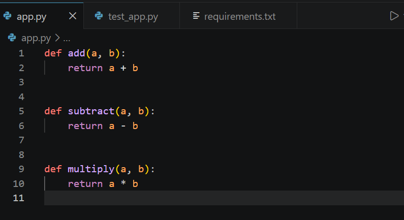
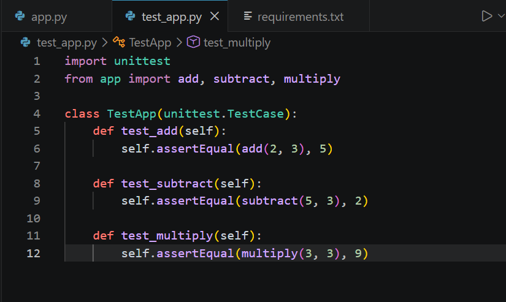
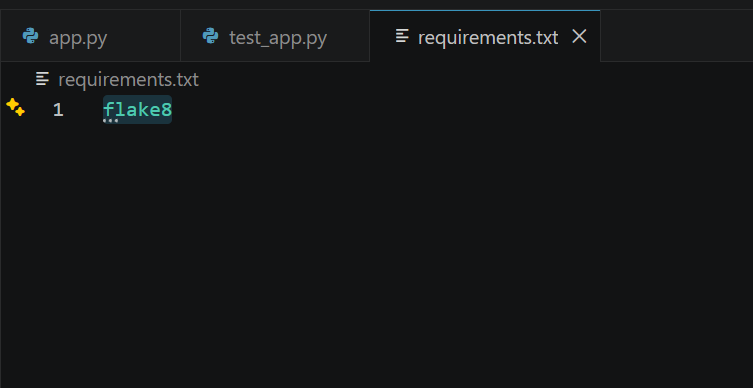
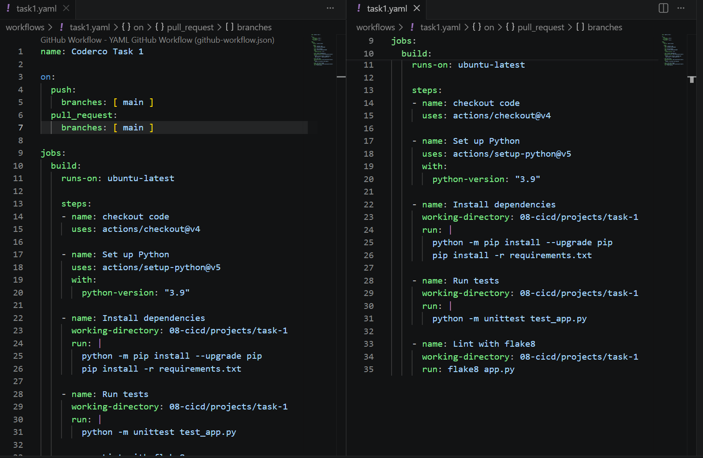

# Task 1 – CI Pipeline with GitHub Actions

## Overview

A GitHub Actions CI pipeline that automatically lints and tests a Python application on every push and pull request to `main`. All checks run on a fresh Ubuntu runner — no manual testing required.

## What This Covers

- GitHub Actions workflow triggered on `push` and `pull_request`
- Automated unit testing with `unittest`
- Automated linting with `flake8`
- `working-directory` scoping to run steps inside a specific project folder

## File Structure

my-devops-journey/
├── .github/workflows/task1.yaml
└── 08-cicd/projects/task-1
    ├── app.py
    ├── test_app.py
    ├── requirements.txt
    └── screenshots/

## The Application

A simple Python module with three functions — add, subtract and multiply. The application itself is intentionally minimal — the focus of this task is the pipeline built around it, not the code.

## Pipeline

name: Coderco Task 1

on:
  push:
    branches: [main]
  pull_request:
    branches: [main]

jobs:
  build:
    runs-on: ubuntu-latest

    steps:
    - name: checkout code
      uses: actions/checkout@v4

    - name: Set up Python
      uses: actions/setup-python@v5
      with:
        python-version: "3.9"

    - name: Install dependencies
      working-directory: 08-cicd/task-1
      run: |
        python -m pip install --upgrade pip
        pip install -r requirements.txt

    - name: Run tests
      working-directory: 08-cicd/task-1
      run: python -m unittest test_app.py

    - name: Lint with flake8
      working-directory: 08-cicd/task-1
      run: flake8 app.py

## Screenshots

### app.py

### test_app.py

### requirements.txt

### Pipeline

## Challenges

**Working directory resets between steps** — each step runs in its own shell so `cd` doesn't persist. Fixed by using `working-directory:` on every step that needs to run inside `task-1/`.

**Linting failures on first run** — `flake8` caught missing blank lines between functions and a missing trailing newline. Fixed the formatting and the pipeline passed on the next push.

## Key Concepts Learned

- CI pipelines catch issues automatically on every push — no manual testing needed
- Linting enforces code style before tests even run
- Each pipeline step runs in an isolated shell — state does not carry between steps
- `working-directory:` scopes steps to a specific folder without needing `cd`
- PR triggers mean code is checked before it can be merged, not after