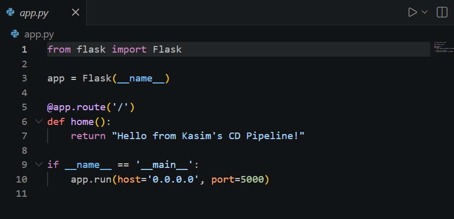
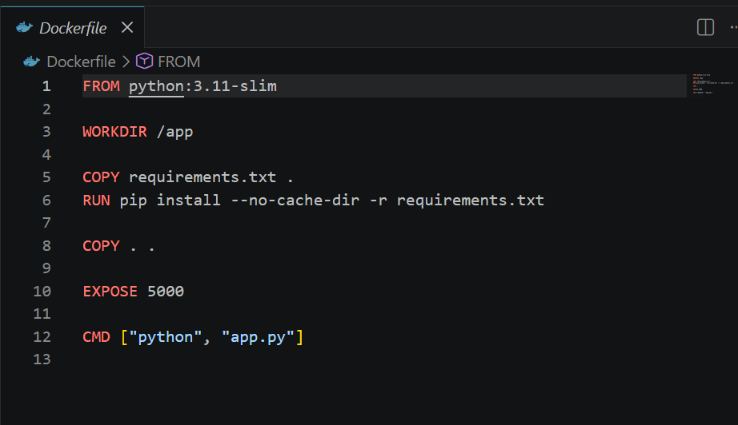
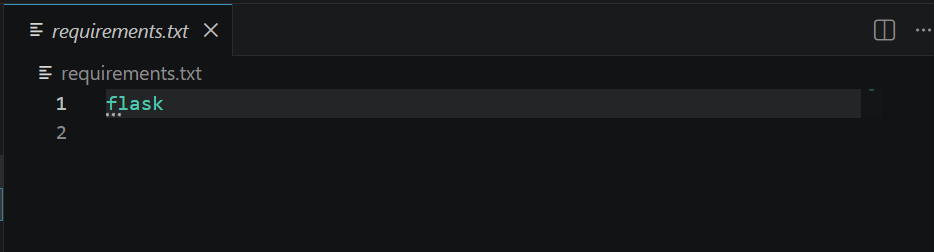
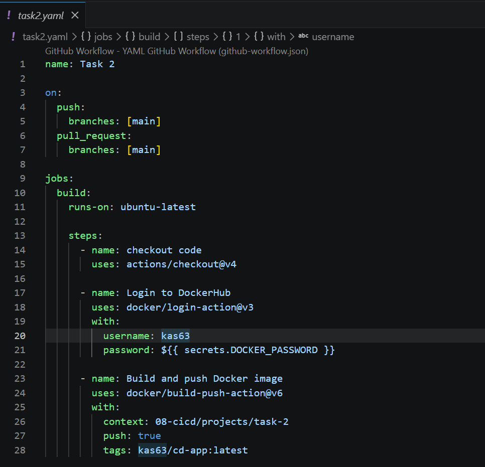
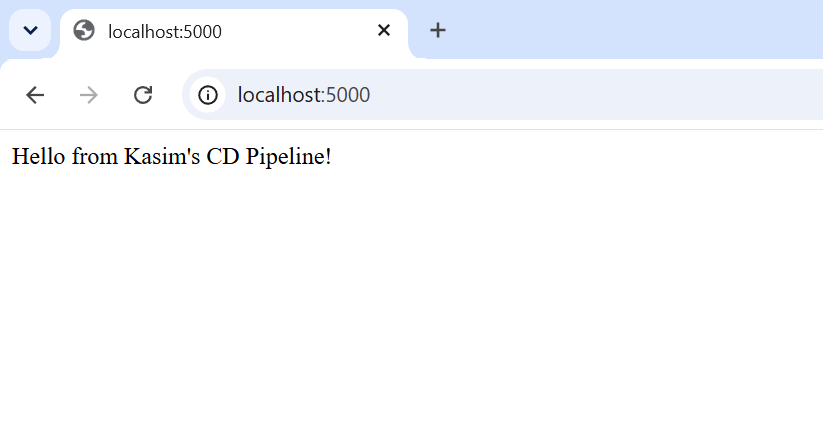

# Task 2 – CD Pipeline with GitHub Actions and Docker Hub

## Overview

A GitHub Actions CD pipeline that automatically builds a Docker image from a Flask application and pushes it to Docker Hub on every push and pull request to `main`. The full loop was verified by pulling and running the image locally.

---

## What This Covers

- GitHub Actions workflow triggered on `push` and `pull_request`
- Docker image built automatically by the pipeline
- Image pushed to Docker Hub using stored credentials as GitHub Secrets
- Full end-to-end verification — pulled image locally and confirmed app running at `localhost:5000`

---

## File Structure

```
my-devops-journey/
├── .github/workflows/task2.yaml
└── 08-cicd/projects/task-2/
    ├── app.py
    ├── requirements.txt
    ├── Dockerfile
    └── screenshots/
```

---

## The Application

A minimal Flask app that returns a response on the root route. The app itself is simple — the focus is the automated build and push pipeline around it.

---

## Pipeline

```yaml
name: Task 2

on:
  push:
    branches: [main]
  pull_request:
    branches: [main]

jobs:
  build:
    runs-on: ubuntu-latest

    steps:
    - name: checkout code
      uses: actions/checkout@v4

    - name: Login to DockerHub
      uses: docker/login-action@v3
      with:
        username: ${{ secrets.DOCKER_USERNAME }}
        password: ${{ secrets.DOCKER_PASSWORD }}

    - name: Build and push Docker image
      uses: docker/build-push-action@v6
      with:
        context: 08-cicd/projects/task-2
        push: true
        tags: kas63/cd-app:latest
```

---

## Screenshots

### app.py


### Dockerfile


### requirements.txt


### Pipeline (task2.yaml)


### Container Running Locally


---

## How to Run Locally

Pull and run the image directly from Docker Hub:

```bash
docker pull kas63/cd-app:latest
docker run -p 5000:5000 kas63/cd-app:latest
```

Then visit `http://localhost:5000`.

---

## Challenges

**`context` path** — initially set `context: .` which pointed Docker to the repo root. The Dockerfile lives inside `08-cicd/projects/task-2/` so the context had to be set to that path explicitly.

**DOCKER_USERNAME as a secret** — initially added the username as a GitHub Secret but the username is not sensitive information. Best practice is to hardcode the username in the tag and only store the password/access token as a secret.

**Docker Hub Access Token** — used a scoped Docker Hub access token instead of the account password for the `DOCKER_PASSWORD` secret. Tokens are revocable without changing the account password — the correct approach for CI pipelines.

---

## Key Concepts Learned

- CD pipelines automate the build and push of Docker images on every code change
- `docker/login-action` and `docker/build-push-action` are pre-built actions that handle Docker Hub authentication and image building
- GitHub Secrets keep credentials out of code — only sensitive values like passwords and tokens should be stored as secrets
- The `context` field in `build-push-action` tells Docker where to find the Dockerfile
- Verifying the full loop — build, push, pull, run — confirms the pipeline works end to end, not just that it completes without errors
